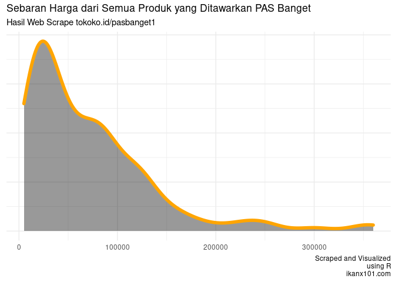

Read Me
================

# Assalamu alaikum

## Algoritma Web Scrape

Salah satu kegunaan data sains adalah untuk mengambil dataset yang
tersedia di publik.

Sebagai contoh, Ustad Fiqih memiliki *online store* yang ada di situs
[tokoko.id](http://tokoko.id/pasbanget1).

Dengan algoritma sederhana, saya bisa mengambil semua data produk dan
harganya dengan mudah dan cepat.

|  id | produk                                    |  harga |
| --: | :---------------------------------------- | -----: |
|   1 | Sari Kacang Hijau                         |   5000 |
|   2 | Sari Kedelai                              |   5000 |
|   3 | Teh Rosella                               |   5000 |
|   4 | Kunyit Asam 250 Ml                        |   5000 |
|   5 | Tissue Kompor                             |   8000 |
|   6 | Seblak Enak Asli Garut                    |  10000 |
|   7 | Kaki Naga Frozen Food                     |  10000 |
|   8 | Kunyit Asam                               |  10000 |
|   9 | Finger Korona                             |  12000 |
|  10 | Sambungan Keran Flexible Filter Air       |  12000 |
|  11 | Cireng Rujak Kharisma                     |  12000 |
|  12 | Chicken Nugger Bellfods                   |  12000 |
|  13 | Abon Ratuku                               |  12000 |
|  14 | Keripik Uni Balado                        |  12000 |
|  15 | Pasta Gigi Herbal Anak Rasa Stoberi       |  13000 |
|  16 | Pasta Gigi Herbal Anak Rasa Anggur        |  13000 |
|  17 | Pasta Gigi Herbal Anak                    |  13000 |
|  18 | Empon-Empon                               |  15000 |
|  19 | Beras Kencur                              |  15000 |
|  20 | Bir Pletok                                |  15000 |
|  21 | Wafle Cokelat Nisin                       |  15000 |
|  22 | Pop Corn Creamello                        |  16000 |
|  23 | Tomyam                                    |  18000 |
|  24 | Tahu Bakso dan Sempol                     |  18000 |
|  25 | Bawang Goreng Sumenep                     |  19000 |
|  26 | Tissue Nice                               |  20000 |
|  27 | Rak Aqua                                  |  20000 |
|  28 | Nugget So Eco 500 gr                      |  20000 |
|  29 | Sabun Propolis                            |  20000 |
|  30 | Pasta Gigi Herbal Propolis                |  20000 |
|  31 | Sabun Madu                                |  20000 |
|  32 | Pasta Gigi Herbal Cengkeh                 |  20000 |
|  33 | Pasta Gigi Herbal HPAI                    |  20000 |
|  34 | Egg Chicken Roll                          |  21000 |
|  35 | Piring Anyaman                            |  22000 |
|  36 | Toppoki                                   |  22000 |
|  37 | Pasta Gigi Herbal Sensitif                |  23000 |
|  38 | Brm Pewangi Pakaian                       |  24000 |
|  39 | Singkong Frozen                           |  24000 |
|  40 | Roti Maryam                               |  24000 |
|  41 | Sabun Kolagen                             |  25000 |
|  42 | Kebab Mini Ekonomis                       |  27000 |
|  43 | Temulawak-Sari Jahe Merah-Sari Kunyit     |  27000 |
|  44 | Rinso Matic 1,8 Liter                     |  29000 |
|  45 | Daging Alpukat Grade A                    |  29000 |
|  46 | Masker Earloop / Masker Kuping            |  30000 |
|  47 | Ember Lipet Foldable                      |  30000 |
|  48 | Kentang Mydibel                           |  30000 |
|  49 | Bakso Warisan Isi 50 Biji                 |  30000 |
|  50 | Facial Wash                               |  30000 |
|  51 | Temulawak Kemasan Toples                  |  30000 |
|  52 | Jahe Merah Kemasan Toples                 |  30000 |
|  53 | Sari Kunyit Kemasan Toples                |  30000 |
|  54 | Kue Kucang 900 gr                         |  30000 |
|  55 | Sosis Kimbo                               |  32000 |
|  56 | Kurma Sukari 500 Gram                     |  32000 |
|  57 | HNI Shampo                                |  35000 |
|  58 | Minyak Zaitun                             |  35000 |
|  59 | Masker Headloop / Masker Hijab            |  40000 |
|  60 | Payung Pelangi Merk Nagoya                |  40000 |
|  61 | HNI Body Wash                             |  40000 |
|  62 | Green Wash Detergent                      |  42000 |
|  63 | Jelly Roll 400 Gr                         |  43000 |
|  64 | Jas Hujan Stelan                          |  45000 |
|  65 | Wajan Gagang Enamel                       |  45000 |
|  66 | Selang Magic Hose 15 m                    |  45000 |
|  67 | Minyak Herbal Sinergi                     |  45000 |
|  68 | Cakwe Udang                               |  48000 |
|  69 | Spicy Wings                               |  50000 |
|  70 | Fish Chips Premium                        |  50000 |
|  71 | Egg ball/Ekado                            |  52000 |
|  72 | Qusthul Hindi Kapsul                      |  55000 |
|  73 | My Gyudon                                 |  57000 |
|  74 | Ebi Fry Premium Yoshinoya                 |  60000 |
|  75 | Timbangan Badan Jumbo                     |  60000 |
|  76 | Daging Slice Yoshinoya dan Slice Teriyaki |  60000 |
|  77 | Sari Kurma                                |  60000 |
|  78 | Habbatusauda HPAI                         |  60000 |
|  79 | Rak Sepatu 10S Amazing                    |  65000 |
|  80 | Laurik                                    |  65000 |
|  81 | Madu Qusthul Hindi                        |  65000 |
|  82 | Papan Tulis White Board                   |  70000 |
|  83 | Harumi                                    |  70000 |
|  84 | Centella Teh Sinergi                      |  70000 |
|  85 | Cangkir Ayam Jago                         |  75000 |
|  86 | Meja Laptop                               |  75000 |
|  87 | Siena                                     |  75000 |
|  88 | Beauty Day Cream                          |  75000 |
|  89 | Etta Goat Milk                            |  75000 |
|  90 | Mushaf Tulis                              |  75000 |
|  91 | Mengkudu Kapsul                           |  80000 |
|  92 | Sterilyn Sanitizer                        |  80000 |
|  93 | Sterilyn Antiseptic                       |  80000 |
|  94 | Extra Food                                |  80000 |
|  95 | Beauty Night Cream                        |  85000 |
|  96 | Andrographis Centella                     |  85000 |
|  97 | Durian Monthong                           |  88000 |
|  98 | Mangkok Ayam Jago                         |  90000 |
|  99 | Magafit                                   |  90000 |
| 100 | Pegagan Hs                                |  90000 |
| 101 | Kelosin (Kelor Sinergi)                   |  90000 |
| 102 | Qur’an Asy Syifaa                         |  90000 |
| 103 | Biosir                                    |  90000 |
| 104 | Spirulina                                 |  90000 |
| 105 | Rosella Hs                                |  90000 |
| 106 | Minyak Zaitun                             |  90000 |
| 107 | Ginextrac                                 |  90000 |
| 108 | Minyak Habbatussauda                      |  95000 |
| 109 | Madu Multiflora                           | 100000 |
| 110 | Oxymeter                                  | 110000 |
| 111 | Truson                                    | 110000 |
| 112 | Kopi 7 Elemen                             | 110000 |
| 113 | Jannatea Hot                              | 115000 |
| 114 | Jannatea Cold                             | 115000 |
| 115 | Qusthul Hindi Bubuk 100 gram              | 115000 |
| 116 | Madu S Jaga                               | 120000 |
| 117 | Madu Pahit                                | 120000 |
| 118 | Langsingin                                | 120000 |
| 119 | Carnocap                                  | 120000 |
| 120 | Sterilyn Disinfectant                     | 120000 |
| 121 | HNI Coffee                                | 125000 |
| 122 | Kurma Sukari                              | 130000 |
| 123 | Gamat                                     | 130000 |
| 124 | Diabextrac                                | 130000 |
| 125 | N-Green                                   | 130000 |
| 126 | Madu Habbat                               | 130000 |
| 127 | Dates Syrup                               | 145000 |
| 128 | Deep Olive                                | 150000 |
| 129 | Bilberry                                  | 150000 |
| 130 | Food Storage / Tempat Makanan 4 Susun     | 160000 |
| 131 | Procumin                                  | 160000 |
| 132 | Procumin                                  | 175000 |
| 133 | Qusthul Hindi Bubuk 200 gram              | 180000 |
| 134 | Mustika Dara                              | 200000 |
| 135 | Hibis                                     | 225000 |
| 136 | Hibis                                     | 230000 |
| 137 | Promol12                                  | 250000 |
| 138 | Deep Squa                                 | 250000 |
| 139 | Al-Ard Palestine Extra Virgin Olive Oil   | 300000 |
| 140 | Stimfibre                                 | 350000 |
| 141 | Deep Beauty                               | 360000 |

Lalu melakukan analisa sederhana seperti melihat sebaran harga dari
semua produk tersebut:

