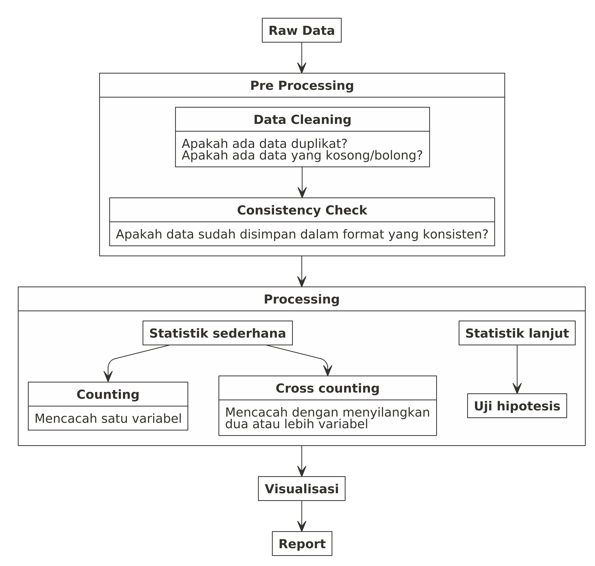
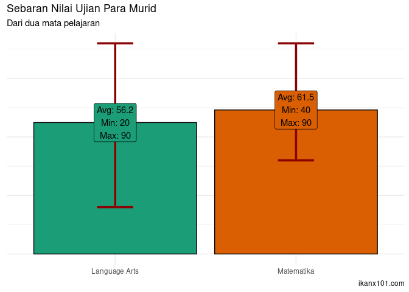
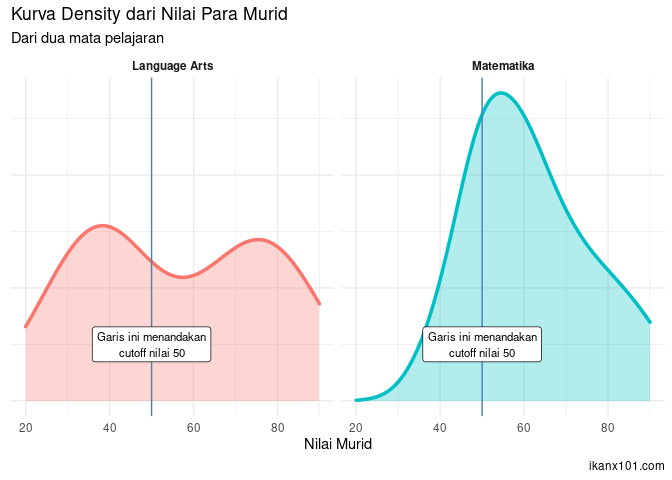
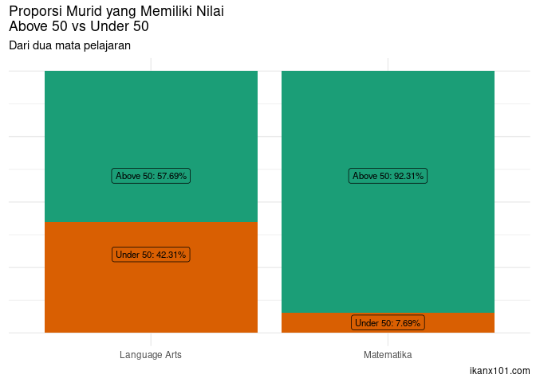
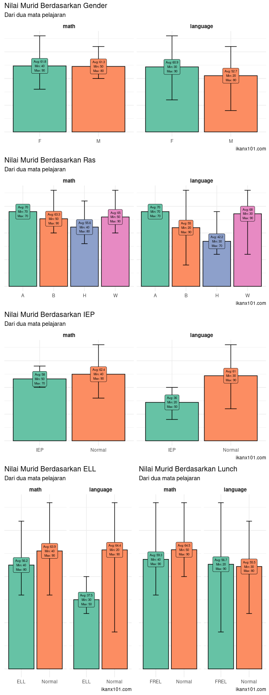
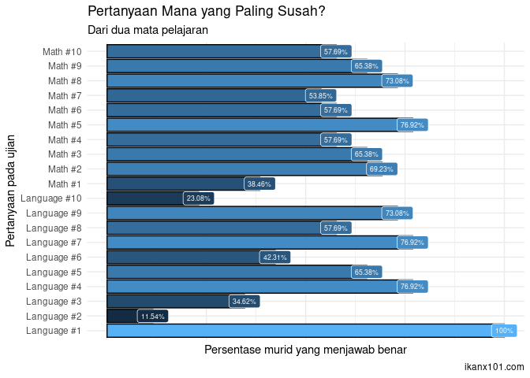

Penjelasan
================

# Assalamu alaikum

## Pendahuluan

Teman-teman PKS Muda, kali ini saya akan memberikan *pre-test* sederhana
untuk melihat sejauh mana kemampuan dan pemahaman kalian terhadap data.

Soal yang saya berikan ini saya sadur dari **data literacy for
teachers** yang digunakan untuk mengecek kompetensi guru di **US**.

Sebagaimana yang telah saya informasikan sebelumnya, data sains bukan
menitikberatkan pada aspek IT, tapi pemahaman terhadap statistik,
matematika, dan logika terhadap data.

Selamat mengerjakan\!

# Deskripsi Test

## Dataset yang Digunakan

Di dalam *folder* ini, teman-teman akan menemukan satu file *excel*
berjudul `Scenario 01.xlsx` berisi 3 *sheets*, yakni:

1.  data murid
2.  ujian matematika
3.  ujian bahasa dan seni

### *Sheet:* `data murid`

*Sheet* ini berisi data murid, mencakup:

1.  *Gender*: jenis kelamin.
2.  *Race*: ras (*asia, black, hispanic, white*).
3.  *Individual Education Plans (IEP) Status*: menandakan murid tersebut
    penyandang disabilitas.
4.  *English Language Learners (ELL) Status*: menandakan murid tersebut
    sedang mempelajari Bahasa Inggris (bukan seseorang yang *fluent*
    berbahasa Inggris).
5.  *Free or Reduced Lunch*: apakah murid tersebut mendapatkan makan
    siang gratis (atau diskon) dari sekolah atau tidak.

### *Sheet:* `ujian matematika`

*Sheet* ini berisi jawaban murid-murid terhadap 10 soal matematika yang
diberikan.

### *Sheet:* `ujian bahasa dan seni`

*Sheet* ini berisi jawaban murid-murid terhadap 10 soal bahasa dan seni
yang diberikan.

## Soal yang Harus Dijawab\!

Berdasarkan data yang ada di atas, seandainya kalian adalah seorang guru
di kelas tersebut, jawablah pertanyaan-pertanyaan berikut ini:

1.  *How do you think your class did overall? How many and what percent
    of your class correctly answered five or more questions?*
2.  *Are there groups of students that did particularly well or
    particularly poorly?*
3.  *Which group(s) are you most concerned about? Why?*
4.  *Which question item(s) are of concern to you? Why?*
5.  *Are there other data or information from this assessment or beyond
    you might like to have to help you make your decisions as a
    teacher?*

Jelaskan dengan kalimat kalian sendiri.

Jawaban bisa ditulis dalam bentuk Excel, Word, PDF, atau Powerpoint.
Silakan menggunakan *tools* apapun untuk menyelesaikan dan menjawab
semua pertanyaan di atas.

## Pengumpulan Jawaban

Jawaban dikumpulkan melalui *email* ke: <ikanx101@alumni.itb.ac.id>
dengan judul *email* **PRETEST PKS MUDA**.

Jawaban dikumpulkan paling lambat **4 Februari 2021**.

-----

# Jawaban\!

Berikut ini adalah **kunci jawaban** resmi dari *pre-test* ini.
Rekan-rekan semua *feel free* untuk berdiskusi dan memberikan *feedback*
terhadap jawaban ini.

Sebelumnya, ada satu informasi yang perlu saya sampaikan.

> Saat kita menerima sebuah data. Jarang sekali kita bisa langsung
> menganalisa data tersebut\!

Sebelum menganalisa, ada baiknya jika kita mengecek terlebih dahulu data
tersebut. Istilahnya dalam *data science* disebut *data pre-processing*.

Sekarang mari kita kerjakan *dataset* ini\!

## *Pre-Processing*

### *Data Cleaning* dan *Consistency Check*

Dari *dataset* yang ada, apakah kalian sadar ada data yang duplikat?

Kalau diperhatikan baik-baik:

  - Pada *sheet* `database` murid, ada **26** orang murid yang
    terdaftar.
  - Pada *sheet* `matematika`, ada nilai dari **26** murid tersebut.
  - Tapi pada *sheet* `language dan arts`, ternyata ada **27** murid.

Kita bisa cek, ternyata **ada duplikat** pada `student id` nomor
`008223`.

Jadi langkah pertama yang harus kita lakukan adalah menghapus salah satu
baris yang duplikat di `student id` nomor `008223`.

## *Processing*

### Pertanyaan 1: *How do you think your class did overall? How many and what percent of your class correctly answered five or more questions?*

Mari kita lihat rekapan nilai ujian berikut ini:

    ## Rekapan Nilai Ujian Murid

| student\_id | math | language |
| :---------- | ---: | -------: |
| 004329      |   90 |       90 |
| 004578      |   50 |       40 |
| 005381      |   80 |       80 |
| 006203      |   70 |       60 |
| 006521      |   50 |       70 |
| 006629      |   70 |       20 |
| 006749      |   60 |       80 |
| 006972      |   90 |       70 |
| 006982      |   40 |       70 |
| 007209      |   50 |       60 |
| 007225      |   60 |       50 |
| 007503      |   40 |       30 |
| 007541      |   60 |       40 |
| 007632      |   60 |       40 |
| 008065      |   50 |       30 |
| 008223      |   50 |       40 |
| 008431      |   60 |       40 |
| 008589      |   50 |       40 |
| 008705      |   80 |       80 |
| 008875      |   50 |       80 |
| 009038      |   60 |       50 |
| 009372      |   80 |       30 |
| 009422      |   70 |       90 |
| 009542      |   60 |       80 |
| 009754      |   50 |       30 |
| 009896      |   70 |       70 |

Sekarang kita lihat persebaran datanya:

Terlihat bahwa murid-murid memiliki nilai yang lebih rendah pada
pelajaran `language arts` dibandingkan `matematika`. Alasannya:

1.  Nilai rata-rata `language` yang lebih rendah.
2.  Ditemukan murid yang memiliki nilai terkecil (sebesar 20) sedangkan
    pada matematika nilai terkecil adalah 40.

Sekarang kita lihat distribusi nilainya:

Dari grafik *density* di atas, terlihat juga informasi bahwa ada dua
puncak nilai di pelajaran `language` sedangkan hanya ada satu puncak di
pelajaran `matematika`.

Apa artinya?

Ada ketimpangan di `language` sehingga ada dua kelompok murid, yakni:

1.  Kelompok murid yang mendapatkan skor rendah (di bawah 50).
2.  Kelompok murid yang mendapatkan skor baik (di atas 50).

Sekarang kita akan lihat, berapa persen murid yang bisa menjawab 5 soal
atau lebih:

### Pertanyaan 2: *Are there groups of students that did particularly well or particularly poorly?*

Sekarang kita akan melakukan analisa berdasarkan kelompok yang ada di
data murid, yakni:

1.  Gender,
2.  Ras,
3.  IEP,
4.  ELL, dan
5.  *Lunch*

Perhatikan rekapan berikut ini:

| student\_id | math | language | sex | race | iep    | ell    | luncheon | status\_math | status\_language |
| ----------: | ---: | -------: | :-- | :--- | :----- | :----- | :------- | :----------- | :--------------- |
|        4329 |   90 |       90 | F   | B    | Normal | Normal | FREL     | Above 50     | Above 50         |
|        4578 |   50 |       40 | M   | H    | Normal | ELL    | FREL     | Above 50     | Below 50         |
|        5381 |   80 |       80 | F   | W    | Normal | Normal | FREL     | Above 50     | Above 50         |
|        6203 |   70 |       60 | M   | B    | Normal | Normal | FREL     | Above 50     | Above 50         |
|        6521 |   50 |       70 | M   | B    | Normal | Normal | Normal   | Above 50     | Above 50         |
|        6629 |   70 |       20 | M   | B    | IEP    | Normal | FREL     | Above 50     | Below 50         |
|        6749 |   60 |       80 | M   | W    | Normal | Normal | FREL     | Above 50     | Above 50         |
|        6972 |   90 |       70 | F   | W    | Normal | Normal | Normal   | Above 50     | Above 50         |
|        6982 |   40 |       70 | F   | H    | Normal | Normal | FREL     | Below 50     | Above 50         |
|        7209 |   50 |       60 | M   | B    | Normal | Normal | FREL     | Above 50     | Above 50         |
|        7225 |   60 |       50 | F   | H    | Normal | ELL    | Normal   | Above 50     | Above 50         |
|        7503 |   40 |       30 | F   | H    | Normal | ELL    | FREL     | Below 50     | Below 50         |
|        7541 |   60 |       40 | M   | H    | Normal | ELL    | Normal   | Above 50     | Below 50         |
|        7632 |   60 |       40 | F   | H    | IEP    | Normal | Normal   | Above 50     | Below 50         |
|        8065 |   50 |       30 | M   | B    | IEP    | Normal | FREL     | Above 50     | Below 50         |
|        8223 |   50 |       40 | M   | H    | Normal | ELL    | Normal   | Above 50     | Below 50         |
|        8431 |   60 |       40 | M   | H    | Normal | ELL    | FREL     | Above 50     | Below 50         |
|        8589 |   50 |       40 | F   | W    | IEP    | Normal | Normal   | Above 50     | Below 50         |
|        8705 |   80 |       80 | M   | W    | Normal | Normal | Normal   | Above 50     | Above 50         |
|        8875 |   50 |       80 | F   | W    | Normal | Normal | FREL     | Above 50     | Above 50         |
|        9038 |   60 |       50 | M   | W    | IEP    | Normal | FREL     | Above 50     | Above 50         |
|        9372 |   80 |       30 | M   | H    | Normal | ELL    | Normal   | Above 50     | Below 50         |
|        9422 |   70 |       90 | F   | W    | Normal | Normal | FREL     | Above 50     | Above 50         |
|        9542 |   60 |       80 | M   | W    | Normal | Normal | Normal   | Above 50     | Above 50         |
|        9754 |   50 |       30 | F   | W    | Normal | ELL    | FREL     | Above 50     | Below 50         |
|        9896 |   70 |       70 | M   | A    | Normal | Normal | Normal   | Above 50     | Above 50         |

Saya akan lakukan cross tabulasi berikut ini:

Kesimpulan:

> Females performed slightly better than the male students. Students
> with disabilities struggled the most followed closely by English
> Language Learners. Asian students as a group, performed the best
> followed by white students. Hispanic students performed the lowest.

### Pertanyaan 3: *Which group(s) are you most concerned about? Why?*

*Students for whom English is not their first language and students with
disabilities. A possible explanation is that the language burden of the
items presented particular difficulty for these students who have
language deficiencies.*

### Pertanyaan 4: *Which question item(s) are of concern to you? Why?*

Kalau bagian-bagian sebelumnya kita membahas terkait murid, sekarang
kita akan menganalisa terkait pertanyaan. Pertanyaan apa saja yang perlu
kita perhatikan?

*There were five items where under half the students responded correctly
(Language \#2 \~ 12%; Language \#10 \~ 23%; Language \#3 \~ 35%;
Language \#6 \~ 42% and Math \#1 \~ 38%).*

*The fact that only 3 students got Language \#2 correct indicates that
there is a real problem with how the content of that item was taught.
The three correct responses may even be guesses on the part of those
students (one had 60% and two with 80%). There needs to be a
consideration of why most of the students struggled with these five
items. Even for the two students who got 90%, Language \#2 was the only
item they got wrong. It is also possible that the item was poorly
written, causing problems with responses or that the items was not
sufficiently aligned to the content of the instruction.*

### Pertanyaan 5: *Are there other data or information from this assessment or beyond you might like to have to help you make your decisions as a teacher?*

*Given that the items were taken from an existing item bank, it would be
helpful to gain a better understanding of how the items aligned to the
instructional content. It is possible that some items failed to align
properly with the curriculum. It might be helpful to get some more local
data, such as exercises or other teacherproduced products that are
better aligned to what has been taught to determine if those results
either confirm or disconfirm the formative assessment data.
Triangulating the sources would help to provide a reliability check.
Another strategy is for the teacher to find an open-ended item to more
closely examine the content that the two particularly problematic items
tap. The teacher could look at attendance data to see if students were
absent when the material was covered (particularly for the highest
scoring students who missed the item). Additionally, as a formative
assessment, the purpose is to help provide a short-term data check to
see where students are and provide an indication of understanding and
misunderstanding to help the teacher modify the next instructional
steps. It provides short-term data for the purpose of informing teachers
on what is needed for instructional modification.*
